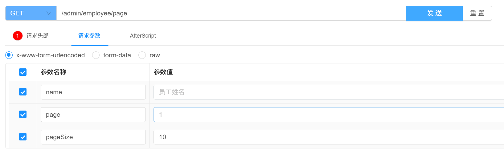

# 2025年12月2日

## 无法找到javax/xml/bind/DatatypeConverter

1. **环境**：使用的是 **JDK 17**。
2. **代码**：项目中使用的 JWT 工具包版本是 `jjwt:0.9.1`（这是一个 2018 年的老版本）。
3. **冲突点**：`jjwt:0.9.1` 的底层依赖于 `javax.xml.bind.DatatypeConverter` 这个类来做 Base64 解码。
	- 这个类在 JDK 8 中是内置的。
	- 但是，**从 JDK 11 开始，Java 官方把 `javax.xml.bind` 包彻底移除了**。
4. **结果**：当代码运行到 `JwtUtil` 解析令牌时，JVM 在 JDK 17 里找不到这个类，于是抛出 `ClassNotFoundException: javax.xml.bind.DatatypeConverter`。


添加依赖

```xml
<dependency>
    <groupId>javax.xml.bind</groupId>
    <artifactId>jaxb-api</artifactId>
    <version>2.3.1</version>
</dependency>
```


# 2025年12月4日

## 登录失败无报错提示信息

问题：


输入错误密码无错误提示，且有报错


解决：

异常未继承BaseException，但调用了BaseException的方法


全局异常处理器使用ExceptionHandler注解，默认捕获RuntimeException异常


指定捕获异常类型


# 2025年12月5日

## 使用Knife4j出现文档请求异常

springboot3.x以上就需要换knife4j依赖为4.x版本的knife4j-openapi3-jakarta-spring-boot-starter依赖

```xml
<dependency>
    <groupId>com.github.xiaoymin</groupId>
    <artifactId>knife4j-openapi3-jakarta-spring-boot-starter</artifactId>
    <version>4.5.0</version>
</dependency>
```

由于从Swagger2变更到Openapi3的标准，故注解以及配置类全部重新该

> 由于Springboot版本为3.5.8不支持Knife4j最新的4.5.0版本，故将Springboot版本降低为3.2.12（悲

```xml
    <parent>
        <groupId>org.springframework.boot</groupId>
        <artifactId>spring-boot-starter-parent</artifactId>
        <version>3.2.12</version>
    </parent>
```


# 2025年12月7日

## Knife4j的调试接口将请求参数对象识别为了请求体


```java
    /**
     * 员工分页查询
     * @param pageQueryDTO
     * @return
     */
    @Operation(summary = "员工分页查询")
    @GetMapping("/page")
    public Result<PageResult> page(@ParameterObject EmployeePageQueryDTO pageQueryDTO) {
        log.info("员工分页查询: {}", pageQueryDTO);
        PageResult pageResult = employeeService.page(pageQueryDTO);
        return Result.success(pageResult);
    }
```


添加 @ParameterObject 注解，效果达成





## 扩展 Spring MVC 框架的消息转换器后Knife4j文档请求异常

源代码如下

```java
public class WebMvcConfig extends WebMvcConfigurationSupport {
    /**
     * 扩展 Spring MVC 框架的消息转换器
     * @param converters
     */
    @Override
    protected void extendMessageConverters(List<HttpMessageConverter<?>> converters) {

        log.info("扩展消息转换器...");

        // 1. 创建一个消息转换器对象
        MappingJackson2HttpMessageConverter converter = new MappingJackson2HttpMessageConverter();

        // 2. 需要为消息转换器设置一个对象转换器，对象转换器可以将 Java 对象序列化为 JSON 数据
        converter.setObjectMapper(new JacksonObjectMapper());

        // 3. 将自己的消息转换器加入到容器中
        converters.add(0, converter);
    }
}
```


原因是扩展 Spring MVC 框架的消息转换器更改了Knife4j的json数据解析，解决方式将消息转换器的优先级调低。

```java
converters.add(1, converter);
```

或者

```jav
converters.add(converters.size() - 1, converter);
```


# 2025年12月9日

## 自动填充字段失败1 (Mybatis-Plus配置)

<font color='red'>在 `update(Wrapper<T> updateWrapper)` 时不会自动填充，需要手动赋值字段条件。</font>

```java
    /**
     * 启用禁用分类
     * @param status
     * @param id
     * @return
     */
    @Override
    public void updateStatus(Integer status, Long id) {
        LambdaUpdateWrapper<Category> wrapper = new LambdaUpdateWrapper<>();
        wrapper.eq(Category::getId, id)
                .set(status != null, Category::getStatus, status);
        this.update(wrapper);
    }
```

```java
    /**
     * 启用禁用分类
     * @param status
     * @param id
     * @return
     */
    @Override
    public void updateStatus(Integer status, Long id) {
        Category category = Category.builder()
                .id(id)
                .status(status)
                .build();
        this.updateById(category);
    }
```


## 自动填充字段出现失败2 (Mybatis-Plus配置)

手动实现中，反射需要依靠方法名

```java
package com.hongs.skycommon.constant;

/**
 * 公共字段自动填充相关常量
 */
public class AutoFillConstant {
    public static final String SET_CREATE_TIME = "setCreateTime";
    public static final String SET_UPDATE_TIME = "setUpdateTime";
    public static final String SET_CREATE_USER = "setCreateUser";
    public static final String SET_UPDATE_USER = "setUpdateUser";
}
```


Mybatis-Plus，的使用中只需要属性即可

```java
package com.hongs.skycommon.constant;

/**
 * 公共字段自动填充相关常量
 */
public class AutoFillConstant {
    public static final String CREATE_TIME = "createTime";
    public static final String UPDATE_TIME = "updateTime";
    public static final String CREATE_USER = "createUser";
    public static final String UPDATE_USER = "updateUser";
}
```


# 2025年12月11日

## xml配置文件中SQL语法错误

```sql
select d.id, d.name, d.category_id, d.price, d.image, d.description,
    d.status, d.update_time, c.name as c.category_name
...
```

`c.name as c.category_name` 中 `AS` 后面的别名（Alias）就是一个纯粹的名字，**不能包含点号（`.`）**。


## xml配置文件中未找到绑定属性

```shell
### Error querying database.  Cause: org.apache.ibatis.binding.BindingException: Parameter 'name' not found. Available parameters are [page, dishPageQueryDTO, param1, param2]
### Cause: org.apache.ibatis.binding.BindingException: Parameter 'name' not found. Available parameters are [page, dishPageQueryDTO, param1, param2]] with root cause
```


修改前：

```xml
<select id="pageQuery" resultType="com.hongs.skycommon.pojo.vo.DishPageQueryVO">
    select d.id, d.name, d.category_id, d.price, d.image, d.description,
    d.status, d.update_time, c.name as category_name
    from dish d
    left join category c on d.category_id = c.id
    <where>
        <if test="name != null and name != ''">
            and d.name like concat('%', #{name}, '%')
        </if>
        <if test="categoryId != null">
            and d.category_id = #{categoryId}
        </if>
        <if test="status != null">
            and d.status = #{status}
        </if>
    </where>
</select>
```

> 传入的是dto，而非几个单一属性


修改后：

```xml
    <select id="pageQuery" resultType="com.hongs.skycommon.pojo.vo.DishPageQueryVO">
        select d.id, d.name, d.category_id, d.price, d.image, d.description,
        d.status, d.update_time, c.name as category_name
        from dish d
        left join category c on d.category_id = c.id
        <where>
            <if test="dishPageQueryDTO.name != null and dishPageQueryDTO.name != ''">
                and d.name like concat('%', #{dishPageQueryDTO.name}, '%')
            </if>
            <if test="dishPageQueryDTO.categoryId != null">
                and d.category_id = #{dishPageQueryDTO.categoryId}
            </if>
            <if test="dishPageQueryDTO.status != null">
                and d.status = #{dishPageQueryDTO.status}
            </if>
        </where>
    </select>
```


还可以起别名，在mapper文件中设置 `@Param("别名")`

> <font color='red'>注意该注解的import应该来自ibatis</font>

```java
public interface DishMapper extends BaseMapper<Dish> {

    /**
     * 菜品分页查询
     * @param page
     * @param dishPageQueryDTO
     * @return
     */
    Page<DishPageQueryVO> pageQuery(Page<DishPageQueryVO> page, @Param("dto") DishPageQueryDTO dishPageQueryDTO);

}
```

```xml
<select id="pageQuery" resultType="com.hongs.skycommon.pojo.vo.DishPageQueryVO">
    select d.id, d.name, d.category_id, d.price, d.image, d.description,
    d.status, d.update_time, c.name as category_name
    from dish d
    left join category c on d.category_id = c.id
    <where>
        <if test="dto.name != null and dto.name != ''">
            and d.name like concat('%', #{dto.name}, '%')
        </if>
        <if test="dto.categoryId != null">
            and d.category_id = #{dto.categoryId}
        </if>
        <if test="dto.status != null">
            and d.status = #{dto.status}
        </if>
    </where>
</select>
```
