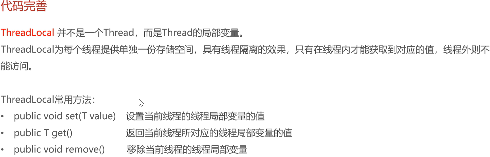

# nginx

## 优点

### 1. 提高访问速度

Nginx 通过**动静分离**和**多级缓存策略**来显著减少网络延迟和后端计算压力，从而提高响应速度。

- 静态资源直接响应：

	Nginx 擅长处理高并发 I/O。对于图片、CSS、JS 等静态文件，Nginx 直接从磁盘读取并返回给客户端，无需转发给 Tomcat（Java 后端）。这避免了 Java 虚拟机（JVM）处理简单文件时的资源浪费。

- 服务端代理缓存 (Proxy Cache)：

	这是 Nginx 自身的缓存。当 Nginx 接收到后端 Tomcat 返回的动态数据（如 JSON 响应）时，会根据配置将其写入本地磁盘或内存。当后续有相同的请求到来时，Nginx 直接读取本地缓存数据返回，完全截断了与后端的通信，从而实现毫秒级响应。

- 客户端浏览器缓存 (Browser Caching)：

	Nginx 通过修改 HTTP 响应头（添加 Cache-Control 或 Expires 字段），向客户端浏览器发送指令。浏览器接收指令后，会将资源存储在本地。在有效期内，用户再次访问时，浏览器直接读取本地文件，根本不发送网络请求。

### 2. 进行负载均衡

Nginx 作为流量的统一入口，负责将高并发的客户端请求分发到后端的多个服务节点上，以解决单机性能瓶颈并实现高可用。

- 流量分发策略：

	Nginx 接收所有进来的请求（通常监听 80/443 端口），并根据预设算法（如轮询、权重 Weight、IP Hash）将这些请求路由到后端的不同服务器实例（如运行在 8080、8081、8082 端口的多个 Tomcat）。

- 故障转移与健康检查：

	Nginx 会持续监控后端服务器的状态。如果其中一个后端节点（例如 8080）宕机或响应超时，Nginx 会自动将后续流量转发给其他健康的节点（如 8081），确保服务不中断，避免单点故障导致整个系统瘫痪。

### 3. 保证后端服务安全

Nginx 作为中间层，通过隔离外网与内网环境、隐藏架构细节来保护后端核心业务服务。

- 隐藏真实网络拓扑：

	客户端只与 Nginx 建立连接，只能看到 Nginx 的 IP 和端口。后端的真实业务服务器（Tomcat）运行在内网或受限网络中，不直接暴露给公网。这防止了攻击者直接扫描或攻击核心数据库和业务服务器的端口。

- 反向代理与路径重写：

	通过配置 proxy_pass，Nginx 将外部请求路径（如 /api/）映射为内部路径（如 /admin/）。这种抽象层屏蔽了后端真实的 API 目录结构和实现细节，增加了攻击者嗅探后端逻辑的难度。

- 请求过滤与黑名单：

	Nginx 可以在流量到达后端 Java 程序之前进行预处理，拦截恶意 IP、限制高频请求（防 DDoS）、拒绝不符合规范的 HTTP 请求，从而保护后端计算资源不被恶意占用。


## 配置方法

### 反向代理


### 负载均衡


 


# Swagger

## 简介


## 使用方式


```java
// 方法名：addResourceHandlers（添加资源处理器）
protected void addResourceHandlers(ResourceHandlerRegistry registry) {

    // -------------------------------------------------------
    // 第一组映射：处理主页
    // -------------------------------------------------------
    // A.【前端请求】当浏览器访问：http://localhost:8080/doc.html
    registry.addResourceHandler("/doc.html")
            // B.【后端指路】告诉 Spring 去 Jar 包里的这个位置找文件：
            // "classpath:" 意味着去所有引入的 Jar 包里找
            .addResourceLocations("classpath:/META-INF/resources/");

    // -------------------------------------------------------
    // 第二组映射：处理静态资源（CSS, JS 等）
    // -------------------------------------------------------
    // A.【前端请求】当浏览器访问：http://localhost:8080/webjars/css/app.css
    registry.addResourceHandler("/webjars/**")
            // B.【后端指路】告诉 Spring 去 Jar 包里的这个位置找：
            .addResourceLocations("classpath:/META-INF/resources/webjars/");
}
```


**当引入 Knife4j 的 Maven 依赖后**

- **真相**：接口文档的页面（`doc.html`）、样式（CSS）、脚本（JS）**并没有**被复制到你的 `src/main/resources/static` 目录下。
- **位置**：它们依然静静地躺在第三方 Jar 包（比如 `knife4j-spring-ui.jar`）的肚子里，具体路径是 `classpath:/META-INF/resources/`。

因为它们不在你的项目源代码文件夹里，Spring MVC 默认可能“视而不见”。


**什么要手动写这个？（关键）**

你可能会问：“Spring Boot 不是全自动的吗？为什么还要我手动写地图？”

- **原因**：你的配置类继承了 **`WebMvcConfigurationSupport`**。
- **后果**：这个类是 Spring MVC 的“高级自定义模式”。一旦你继承了它，Spring Boot 就会认为“这个开发者是个高手，他想完全自己控制 MVC 配置”，于是 Spring Boot 就会**自动关闭**默认的静态资源配置（Default Auto Configuration）。
- **结局**：因为默认配置失效了，Spring 就不再去 Jar 包的 `META-INF/resources` 里找东西了。如果你不写上面这段代码，访问文档就会报 **404 Not Found**。


> 当你启动项目时，Spring 会把：
>
> 1. 你自己写的 `src/main/resources`
> 2. 依赖 A.jar 里的 `META-INF/resources`
> 3. 依赖 B.jar 里的 `META-INF/resources`
>
> **在内存中**逻辑上合并成一个大的资源池。


## Swagger2和Openapi3的差别

### 核心Bean配置

#### 1. 核心配置速查表

| **配置项**       | **旧版 (Springfox / Swagger 2)**    | **新版 (SpringDoc / OpenAPI 3)**                         | **核心区别**                                                 |
| ---------------- | ----------------------------------- | -------------------------------------------------------- | ------------------------------------------------------------ |
| **核心配置对象** | `Docket`                            | **`OpenAPI`** (全局信息) **`GroupedOpenApi`** (分组扫描) | 旧版一个对象包揽所有；新版将“文档元数据”和“接口分组”拆分了。 |
| **文档基础信息** | `ApiInfo` / `ApiInfoBuilder`        | **`Info`** (`io.swagger.v3.oas.models.info.Info`)        | 类名变了，构造方式从 Builder 模式变为链式 Setter。           |
| **包扫描方式**   | `.apis(RequestHandlerSelectors...)` | **`.packagesToScan("...")`** (在 GroupedOpenApi 中)      | 新版方法名更直观，也可以直接在 YAML 中配置。                 |
| **路径过滤**     | `.paths(PathSelectors.any())`       | **`.pathsToMatch("/\**")`**                              | 新版直接使用 Ant 风格路径字符串。                            |
| **文档类型声明** | `DocumentationType.SWAGGER_2`       | **不需要声明**                                           | 默认就是 OpenAPI 3。                                         |
| **全局参数**     | `.globalOperationParameters(...)`   | `.components(...)`                                       | 新版需要配置 Components 或 SecuritySchemes。                 |


#### 2. 代码详细对比

#####  旧版方案 (Swagger 2)

**特点**：所有的配置（信息 + 扫描）都塞在一个 `Docket` Bean 里。

```java
@Bean
public Docket docket() {
    ApiInfo apiInfo = new ApiInfoBuilder()
            .title("苍穹外卖项目接口文档")
            .version("2.0")
            .description("项目描述")
            .build();
            
    return new Docket(DocumentationType.SWAGGER_2)
            .apiInfo(apiInfo) // 设置信息
            .select()
            .apis(RequestHandlerSelectors.basePackage("com.hongs.skyserver.controller")) // 设置扫描
            .build();
}
```


##### 新版方案 A：纯 Java Bean 配置 (Explicit Style)

特点：不依赖 YAML，完全通过 Java 代码控制。适合需要配置多个分组（如管理端、用户端）的复杂场景。

需要定义两个 Bean：

1. `OpenAPI`: 配置文档标题等元数据。
2. `GroupedOpenApi`: 配置具体的包扫描路径。

```java
@Configuration
public class WebMvcConfig {

    /**
     * 1. 配置文档元数据 (标题、版本)
     */
    @Bean
    public OpenAPI customOpenAPI() {
        return new OpenAPI()
                .info(new Info()
                        .title("苍穹外卖项目接口文档")
                        .version("2.0")
                        .description("项目描述"));
    }

    /**
     * 2. 配置接口扫描 (替代原来的 .apis 和 .paths)
     */
    @Bean
    public GroupedOpenApi publicApi() {
        return GroupedOpenApi.builder()
                .group("默认接口")                  // 设置分组名
                .packagesToScan("com.hongs.skyserver.controller") // 指定扫描包
                .pathsToMatch("/**")              // 匹配所有路径
                .build();
    }
    
    // 如果有管理端分组，可以再定义一个 Bean
    /*
    @Bean
    public GroupedOpenApi adminApi() {
        return GroupedOpenApi.builder()
                .group("管理端接口")
                .packagesToScan("com.hongs.skyserver.controller.admin")
                .build();
    }
    */
}
```


##### 新版方案 B：Java Bean + YAML 组合配置

**特点**：最简洁。Java 只负责定义“文档叫什么”，YAML 负责定义“扫描哪里”。

**第一步：Java 代码 (WebMvcConfig.java)**

```java
@Configuration
public class WebMvcConfig {

    /**
     * 仅配置文档元数据
     * 扫描逻辑移交 YAML 处理，这里不需要 GroupedOpenApi
     */
    @Bean
    public OpenAPI customOpenAPI() {
        return new OpenAPI()
                .info(new Info()
                        .title("苍穹外卖项目接口文档")
                        .version("2.0")
                        .description("项目描述"));
    }
}
```

**第二步：配置文件 (application.yml)**

```yaml
springdoc:
  # 对应 .apis(RequestHandlerSelectors.basePackage(...))
  packages-to-scan: com.hongs.skyserver.controller
  
  # 对应 .paths(PathSelectors.any())
  paths-to-match: /**
  
  # 其他常用配置
  api-docs:
    enabled: true
```


> 分组情况下的写法
>
> ```yaml
> springdoc:
>   # 全局配置（所有分组通用的）
>   api-docs:
>     enabled: true
>   
>   # 【核心】这里配置分组，替代 Java 中的 GroupedOpenApi Bean
>   group-configs:
>     # 第 1 组：管理端接口
>     - group: "admin"
>       paths-to-match: "/admin/**"
>       packages-to-scan: com.hongs.skyserver.controller.admin
>       
>     # 第 2 组：用户端接口
>     - group: "user"
>       paths-to-match: "/user/**"
>       packages-to-scan: com.hongs.skyserver.controller.user
> ```


### 主要注解变化

#### 1. 核心注解速查表

| **作用域**          | **旧版注解 (Swagger 2)** | **新版注解 (OpenAPI 3)** | **常用属性变化 (旧 -> 新)**                       |
| ------------------- | ------------------------ | ------------------------ | ------------------------------------------------- |
| **Controller 类**   | `@Api`                   | **`@Tag`**               | `tags` -> `name`                                  |
| **接口方法**        | `@ApiOperation`          | **`@Operation`**         | `value` -> `summary` `notes` -> `description`     |
| **实体类 (DTO/VO)** | `@ApiModel`              | **`@Schema`**            | `value` -> `description`/`title`                  |
| **实体属性**        | `@ApiModelProperty`      | **`@Schema`**            | `value` -> `description`                          |
| **参数 (非Body)**   | `@ApiParam`              | **`@Parameter`**         | `value` -> `description` `required` -> `required` |
| **忽略/隐藏**       | `@ApiIgnore`             | **`@Hidden`**            | 无                                                |


#### 2. 详细代码对比示例

假设你有一个 `EmployeeController` 和一个 `EmployeeLoginDTO`，我们来看看具体的写法区别。

##### A. Controller 层对比

**旧版 (Swagger 2):**

```java
import io.swagger.annotations.Api;
import io.swagger.annotations.ApiOperation;
import io.swagger.annotations.ApiParam;

@Api(tags = "员工管理接口") // 旧版
@RestController
@RequestMapping("/admin/employee")
public class EmployeeController {

    @ApiOperation(value = "员工登录", notes = "返回token") // 旧版
    @PostMapping("/login")
    public Result<EmployeeLoginVO> login(
            @RequestBody @ApiParam("登录参数") EmployeeLoginDTO employeeLoginDTO) { // 旧版
        // ...
        return Result.success();
    }
}
```

**新版 (OpenAPI 3):**

```java
import io.swagger.v3.oas.annotations.tags.Tag;
import io.swagger.v3.oas.annotations.Operation;
import io.swagger.v3.oas.annotations.Parameter;

@Tag(name = "员工管理接口") // 【变化1】用 @Tag，属性为 name
@RestController
@RequestMapping("/admin/employee")
public class EmployeeController {

    @Operation(summary = "员工登录", description = "返回token") // 【变化2】value变summary, notes变description
    @PostMapping("/login")
    public Result<EmployeeLoginVO> login(
            @RequestBody @Parameter(description = "登录参数") EmployeeLoginDTO employeeLoginDTO) { // 【变化3】用 @Parameter
        // ...
        return Result.success();
    }
}
```

##### B. 实体类 (DTO/VO) 层的对比

这是改动最大的地方，旧版区分了 `@ApiModel` (类) 和 `@ApiModelProperty` (字段)，**新版统一使用 `@Schema`**。

**旧版 (Swagger 2):**

```java
import io.swagger.annotations.ApiModel;
import io.swagger.annotations.ApiModelProperty;

@Data
@ApiModel(description = "员工登录DTO") // 旧版
public class EmployeeLoginDTO {

    @ApiModelProperty(value = "用户名", example = "admin", required = true) // 旧版
    private String username;

    @ApiModelProperty("密码")
    private String password;
}
```

**新版 (OpenAPI 3):**

```java
import io.swagger.v3.oas.annotations.media.Schema;

@Data
@Schema(description = "员工登录DTO") // 【变化1】类上也用 @Schema
public class EmployeeLoginDTO {

    @Schema(description = "用户名", example = "admin", requiredMode = Schema.RequiredMode.REQUIRED) // 【变化2】统一用 @Schema
    private String username;

    @Schema(description = "密码")
    private String password;
}
```


#### 3. 其他常见细节变化

##### 1. 忽略某个参数或接口

- **旧版**: `@ApiIgnore`
- **新版**: `@Hidden` (可以加在方法上，也可以加在参数上)

##### 2. 多个参数描述

虽然 Spring Boot 推荐直接在参数前加注解，但如果你习惯用方法头的注解：

- **旧版**:

	```java
	@ApiImplicitParams({
	    @ApiImplicitParam(name = "id", value = "用户ID", required = true)
	})
	```

- **新版**:

	```java
	import io.swagger.v3.oas.annotations.Parameters;
	
	@Parameters({
	    @Parameter(name = "id", description = "用户ID", required = true)
	})
	```


#### 4. 迁移建议

1. 全局替换包名：

	在 IDEA 中全局替换 import io.swagger.annotations. -> import io.swagger.v3.oas.annotations. (注意这会导致报错，需要配合后续步骤)。

2. 正则替换常用注解：

	利用 IDEA 的全局替换 (Ctrl+Shift+R)，使用正则表达式或直接文本替换：

	- `@Api(tags =`  ->  `@Tag(name =`
	- `@ApiOperation(value =`  ->  `@Operation(summary =`
	- `@ApiModelProperty`  ->  `@Schema`
	- `@ApiModel` -> `@Schema`

3. 处理编译错误：

	替换完后，肯定会有很多属性名报错（比如 @Schema 没有 value 属性，只有 description）。这时再针对性地修改报错的地方。通常 @Schema("描述") 这种写法在新版中也是支持的（它是 description 的别名），所以大部分 @ApiModelProperty("描述") 替换为 @Schema("描述") 后是可以直接运行的。


# ThreadLocal

## 介绍




## 使用

```java
public class BaseContext {
    private static final ThreadLocal<Long> thread = new ThreadLocal<>();

    public static void setCurrentId(Long id) {
        thread.set(id);
    }

    public static Long getCurrentId() {
        return thread.get();
    }

    public static void removeCurrentId() {
        thread.remove();
    }
}
```


```java
package com.hongs.skyserver.interceptor;

import com.hongs.skycommon.constant.JwtClaimsConstant;
import com.hongs.skycommon.context.BaseContext;
import com.hongs.skycommon.properties.JwtProperties;
import com.hongs.skycommon.utils.JwtUtil;
import io.jsonwebtoken.Claims;
import jakarta.servlet.http.HttpServletRequest;
import jakarta.servlet.http.HttpServletResponse;
import lombok.extern.slf4j.Slf4j;
import org.springframework.beans.factory.annotation.Autowired;
import org.springframework.stereotype.Component;
import org.springframework.web.method.HandlerMethod;
import org.springframework.web.servlet.HandlerInterceptor;

/**
 * Jwt令牌校验的拦截器
 */
@Component
@Slf4j
public class JwtTokenAdminInterceptor implements HandlerInterceptor {
    @Autowired
    private JwtProperties jwtProperties;

    /**
     * 校验Jwt
     *
     * @param request
     * @param response
     * @param handler
     * @return
     * @throws Exception
     */
    public boolean preHandle(final HttpServletRequest request, final HttpServletResponse response, final Object handler) throws Exception {
        // 判断当前拦截到的是Controller的方法还是其他资源
        if (!(handler instanceof HandlerMethod)) {
            // 当前拦截到的不是动态方法，直接放行
            return true;
        }

        String token = request.getHeader(jwtProperties.getAdminTokenName());

        try {
            log.info("Jwt令牌校验: {}", token);
            Claims claims = JwtUtil.parseJWT(jwtProperties.getAdminSecretKey(), token);
            Long empId = Long.valueOf(claims.get(JwtClaimsConstant.EMP_ID).toString());
            log.info("当前员工ID: {}", empId);
            BaseContext.setCurrentId(empId);

            return true;
        } catch (Exception e) {
            response.setStatus(HttpServletResponse.SC_UNAUTHORIZED);
            return false;
        }
    }
}
```


## **ThreadLocal** 与 **HttpServletRequest** 方案对比

### 方案一：放入 HttpServletRequest

这种方案直接利用 Web 容器提供的 Request 域进行属性传递。

#### 1. 实现方式

- **拦截器层**：`request.setAttribute("userId", 100L);`
- **Controller层**：`Long userId = (Long) request.getAttribute("userId");`
- **Service层**：方法参数必须显式接收 `userId`。

#### 2. 代码演示

```java
// Controller
@PostMapping
public Result save(@RequestBody OrderDTO dto, HttpServletRequest request) {
    Long userId = (Long) request.getAttribute("userId");
    // 必须把 userId 传给 Service
    orderService.createOrder(dto, userId); 
    return Result.success();
}

// Service
public void createOrder(OrderDTO dto, Long userId) {
    // 业务逻辑...
    order.setUserId(userId);
    
    // ❌ 如果 Service 还要调用其他 Service，还得继续往下传
    inventoryService.deduct(dto.getSkuId(), userId); 
}
```

#### 3. 缺点分析 (痛点)

1. 代码侵入严重（参数污染）：

	Service 层的每个方法都需要增加一个 Long userId 参数。如果调用链路很深（Controller -> Service A -> Service B -> Manager -> Dao），每一层的方法签名都要改，代码极其臃肿。

2. 架构耦合（依赖 Web 层）：

	Service 应该是纯粹的业务逻辑。如果 Service 依赖了 HttpServletRequest 或者为了拿 ID 被迫修改方法签名，一旦未来项目迁移（例如改为 Dubbo RPC 接口、MQ 消费者逻辑），这些没有 Request 对象的场景下，Service 代码就会报错。


### 方案二：使用 ThreadLocal

这种方案利用 JVM 的线程特性，将 ID 绑定在“当前线程”上，实现跨层级的数据共享。

#### 1. 实现方式

- **工具类**：封装 `ThreadLocal`，提供 `set` / `get` / `remove` 方法。
- **拦截器层**：`BaseContext.setCurrentId(userId);`
- **任意层级**：`BaseContext.getCurrentId();` 直接获取。

#### 2. 代码演示 (无需传参)

**ThreadLocal 工具类：**

```java
public class BaseContext {
    private static final ThreadLocal<Long> THREAD_LOCAL = new ThreadLocal<>();

    public static void setCurrentId(Long id) { THREAD_LOCAL.set(id); }
    public static Long getCurrentId() { return THREAD_LOCAL.get(); }
    public static void removeCurrentId() { THREAD_LOCAL.remove(); }
}
```

**业务代码（清爽）：**

```java
// Controller
@PostMapping
public Result save(@RequestBody OrderDTO dto) {
    // 不需要从 request 拿，也不用传参
    orderService.createOrder(dto);
    return Result.success();
}

// Service A
public void createOrder(OrderDTO dto) {
    // ✅ 需要用到 ID 时，随时随地直接取
    Long currentId = BaseContext.getCurrentId();
    
    order.setUserId(currentId);
    
    // 调用 Service B (完全不用管 ID 传递的问题)
    inventoryService.checkStock(dto.getSkuId());
}

// Service B (深层调用示例)
public void checkStock(Long skuId) {
    // 假如这里需要记录“是谁在查库存”的日志
    log.info("用户 {} 正在检查库存", BaseContext.getCurrentId()); 
}
```

#### 3. 优点分析

1. **数据“隐形”传递**：实现了数据的**穿透**。无论调用链有多深（比如在 Service 内部调用的工具类、日志切面 Aspect、或者私有辅助方法中），只要在同一个线程内，都能直接拿到 ID，无需层层传参。
2. **松耦合**：Service 层不需要知道 `HttpServletRequest` 的存在，也不需要知道 Token 是怎么解析的。代码更纯粹，易于单元测试和复用。


### 常用场景对比 (为什么 ThreadLocal 更好)

| **场景**               | **使用 Request 方案的后果**                                  | **使用 ThreadLocal 方案的效果**                              |
| ---------------------- | ------------------------------------------------------------ | ------------------------------------------------------------ |
| **公共字段赋值**       | `save`, `update` 等所有 Service 方法都要多加一个参数 `userId`。 | Service 内部直接 `setCreateUser(BaseContext.getCurrentId())`，方法签名保持干净。 |
| **操作日志记录 (AOP)** | 想在 `@Aspect` 切面里记录“谁操作了该接口”，很难拿到参数里的 userId。 | 在 Aspect 任意位置直接调用 `BaseContext.getCurrentId()` 即可拿到操作人。 |
| **数据权限校验**       | 底层 Dao 或 Manager 需要根据 UserId 过滤数据（如只能查自己的单）。 | 不需要从 Controller 一路传到 Dao，Dao 层直接获取 ID 拼装 SQL 条件。 |
| **RPC 调用/MQ**        | 如果未来接口不是通过 HTTP 触发的（无 Request 对象）。        | ThreadLocal 方案依然适用（只需在入口处 mock 一个 ID 放入上下文即可）。 |


## 注意事项

使用 `ThreadLocal` 方案时，必须遵守 **“有借有还”** 的原则：

在拦截器的 `afterCompletion` 方法中，**必须**调用 `BaseContext.removeCurrentId()`。

- **原因**：Tomcat 使用线程池复用线程。如果当前请求结束不清理，该线程处理下一个请求时，ThreadLocal 里可能还残留着上一个用户的 ID，导致严重的**数据泄露**（用户 A 看到了用户 B 的数据）。

```java
@Override
public void afterCompletion(...) {
    BaseContext.removeCurrentId(); // 必须清理！
}
```

>拦截器的三种方法
>
>| **方法名**          | **含义**   | **返回值** | **核心用途**       | **你的项目用处**                   |
>| ------------------- | ---------- | ---------- | ------------------ | ---------------------------------- |
>| **preHandle**       | 目标方法前 | `boolean`  | 登录校验、权限拦截 | **解析 Token，存入 ThreadLocal**   |
>| **postHandle**      | 目标方法后 | `void`     | 修改 ModelAndView  | 基本不用 (因为是 JSON 接口)        |
>| **afterCompletion** | 请求完成后 | `void`     | 资源清理、异常兜底 | **清理 ThreadLocal，防止内存泄漏** |
